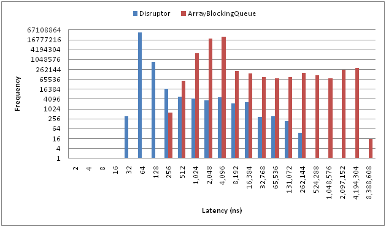

## Read This First

To understand the problem the Disruptor is trying to solve, and to get a feel for why this concurrency framework is so 
fast, read the [Technical Paper](./files/Disruptor-1.0.pdf). It also contains detailed performance results.

And now for some words from our sponsors... LMAX are recruiting once again. If you are interested in working with a 
great team, with some amazing technology, and think you can add something to the mix then please check out our 
[jobs page](https://careers.lmax.com/).

## What is the Disruptor?

[LMAX](https://www.lmax.com) aims to be the fastest trading platform in the world. Clearly, in order to achieve this we 
needed to do something special to achieve very low-latency and high-throughput with our Java platform. Performance 
testing showed that using queues to pass data between stages of the system was introducing latency, so we focused on 
optimising this area.

The Disruptor is the result of our research and testing. We found that cache misses at the CPU-level, and locks 
requiring kernel arbitration are both extremely costly, so we created a framework which has "mechanical sympathy" for 
the hardware it's running on, and that's lock-free.

This is not a specialist solution, it's not designed to work only for a financial application. The Disruptor is a 
general-purpose mechanism for solving a difficult problem in concurrent programming.

It works in a different way to more conventional approaches, so you use it a little differently than you might be used 
to. For example, applying the pattern to your system is not as simple as replacing all your queues with the 
[magic ring buffer](https://trishagee.com/2011/06/22/dissecting_the_disruptor_whats_so_special_about_a_ring_buffer/). 
We've got [code samples](https://github.com/LMAX-Exchange/disruptor/wiki/Code-Example-Disruptor2x) to guide you, a 
growing number of [blogs and articles](https://github.com/LMAX-Exchange/disruptor/wiki/Blogs-And-Articles) giving an 
overview of how it works, the [technical paper](./files/Disruptor-1.0.pdf) goes into some detail as you'd expect, and 
the performance tests give examples of how to use the Disruptor.

If you prefer real, live people explaining things instead of a dry paper or content-heavy website, there's always the 
[presentation Mike and Martin gave](https://www.infoq.com/presentations/LMAX/) at QCon San Francisco. If you fancy a 
natter with the folks involved head over to our [Discussion Group](https://groups.google.com/g/lmax-disruptor). 
Martin Thompson will also witter on occasionally about performance in his 
[Mechanical Sympathy blog](https://mechanical-sympathy.blogspot.com/).
Martin Fowler has also done a great [review](https://martinfowler.com/articles/lmax.html) of the Disruptor's application
 at LMAX.

## What's the big deal?

It's fast. Very fast.

Note that this is a log-log scale, not linear. If we tried to plot the comparisons on a linear scale, we'd run out of 
space very quickly. We have performance results of the test that produced these results, plus others of throughput 
testing.

## Great What do I do next?

 - [Getting Started](https://github.com/LMAX-Exchange/disruptor/wiki/Getting-Started)
 - Read the [API documentation](./javadoc/index.html)
 - Check out our [Frequently Asked Questions](https://github.com/LMAX-Exchange/disruptor/wiki/Frequently-Asked-Questions)

## Discussion, Blogs & Other Useful Links

 - [Disruptor Google Group](https://groups.google.com/g/lmax-disruptor)
 - [Disruptor Technical Paper](./files/Disruptor-1.0.pdf)
 - [Martin Fowler's Technical Review](http://martinfowler.com/articles/lmax.html)
 - [.NET Disruptor Port](https://github.com/odeheurles/Disruptor-net)
 - [LMAX Exchange](http://www.lmax.com)
 - [LMAX Staff Blogs](https://www.lmax.com/blog/staff-blogs/)
 - [Mechanical Sympathy](http://mechanical-sympathy.blogspot.com) (Martin Thompson)
 - [Bad Concurrency](http://bad-concurrency.blogspot.com) (Michael Barker)

## Presentations

 - [Disruptor presentation @ QCon SF](http://www.infoq.com/presentations/LMAX)
 - [Introduction to the Disruptor](https://www.slideshare.net/trishagee/introduction-to-the-disruptor?from=new_upload_email)
